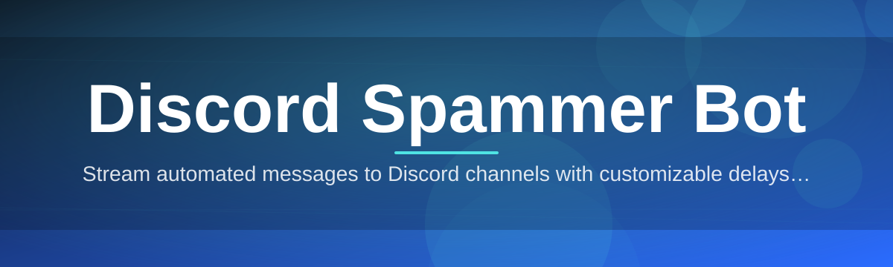

# discord-spam-utility 🚀💬

  

*A pocket-sized message automation toolkit built for people who got tired of clicking "send" a thousand times a day.*

---

## 🪞 Before & After

| | 😩 Before discord-spam-utility | 🎉 After discord-spam-utility |
|---|---|---|
| **Repetitive messaging** | Manually retyping the same announcement in 12 channels | One template, queued and fired automatically |
| **Timing** | Copy-paste-send, copy-paste-send, forever | Configurable intervals with jitter, hands-off |
| **Multi-target testing** | Alt-tabbing between windows for load checks | Centralized queue dispatching to multiple targets |
| **Setup effort** | Sketchy scripts, half-broken dependencies | Single standalone `.exe`, double-click and go |
| **Visibility** | No idea what happened or when | Built-in live log panel + run history |

> [!NOTE]
> This project was born out of a genuinely nerdy weekend itch: "why does testing message throughput on my own servers require ten browser tabs?" So I built the tool I wished existed.

---

## 🔥 Overview

**discord-spam-utility** is a lightweight Windows utility for automating repetitive message dispatch on Discord — built for server admins stress-testing their own bots, community managers running scheduled announcement waves, and developers who need a controlled, repeatable way to simulate message load without wiring together a dozen scripts. It's the kind of tool you build once you've manually pasted the same "server maintenance starting in 5 minutes" message into six channels for the third week in a row.

Under the hood it's intentionally simple: no bloated dependency tree, no background services phoning home, no fifteen-tab setup wizard. Just a focused, single-purpose executable that does one job — queuing and dispatching messages on a schedule you control — and does it predictably, transparently, and with full visibility into what's happening at every step.

This is a passion project first and a utility second. I wanted something that felt *good* to use: snappy UI, sane defaults, a log you can actually read, and zero mystery about what the tool is doing behind the curtain. If you've ever wanted a **Discord spammer bot** that respects your time and your sanity instead of fighting you the whole way, this is built for exactly that itch.

  

---

## ⚡ What It Actually Does

- **Message Queue Engine** — Load a batch of messages, set the order (sequential or shuffled), and let the queue engine handle the rest without babysitting it.

- **Interval Scheduling** — Set fixed delays or randomized jitter windows between sends so your automation timing feels intentional rather than robotic.

- **Multi-Channel Targeting** — Point the same message batch at multiple channel IDs in one run, instead of manually switching context every time.

- **Live Log Console** — Every send attempt, success, and failure streams into a built-in console panel in real time — no digging through log files.

- **Template Variables** — Drop in placeholders like counters or timestamps so repeated messages don't look like dead copies of each other.

- **Run History** — Every session gets a timestamped record so you can review exactly what fired, when, and where.

- **Rate-Aware Throttling** — Built-in cooldown logic that backs off automatically when responses slow down, keeping your automation well-behaved.

- **Portable Profiles** — Save your message sets and settings as profiles you can swap between in one click — handy for testing different announcement campaigns.

---

## 🧭 Getting Off the Ground

> [!TIP]
> The whole setup takes less time than reading this section.

1. **Visit the landing page** — Hit the download button above to land on the official project page.

2. **Grab the latest build** — Download the standalone `.exe`. No installer, no bundled toolbar, no nonsense.

3. **Run it** — Double-click. Windows Defender may flag unfamiliar executables the first time — that's normal for indie tools without a paid code-signing cert.

4. **Configure and launch** — Drop in your message templates, set your interval, hit start, and watch the log console light up.

---

## 🖥️ System Requirements

| Requirement | Details |
|---|---|
| **OS** | Windows 10 or Windows 11 (64-bit) |
| **Dependencies** | None — fully standalone executable |
| **Disk space** | Under 50 MB |
| **RAM** | Negligible, runs fine on low-spec machines |
| **Internet** | Required for outbound message dispatch |

  

> [!IMPORTANT]
> This tool is designed for use on servers and channels **you own or have explicit permission to test on.** It is not a mass-messaging or harassment tool, and it should never be used as one.

---

## 🛠️ How It Works

The architecture is deliberately minimal — four moving parts, no hidden magic:

1. **Input stage** — You load a message template set and target list into the queue builder.

2. **Scheduler stage** — The interval engine calculates send timing, including any jitter you've configured.

3. **Dispatch stage** — Messages are sent one at a time through the dispatch worker, respecting throttling rules.

4. **Feedback stage** — Each result (success, retry, or failure) streams back into the live log and gets written to run history.

---

## 🧩 Troubleshooting

<strong>The app won't launch, Windows says it's "unrecognized."</strong>

This is standard SmartScreen behavior for smaller, indie-signed executables. Click "More info" → "Run anyway." The binary is not modified between builds, and hashes are visible on the landing page.

<strong>My messages are sending but arriving out of order.</strong>

Check whether shuffle mode is enabled in your queue settings. Sequential mode preserves exact order; shuffle mode intentionally randomizes it for load-testing variety.

<strong>The tool paused itself mid-run.</strong>

That's the rate-aware throttling kicking in. It automatically backs off when it detects slower response times, then resumes once things stabilize. This is intentional and protects your account standing.

<strong>Can I run multiple profiles at once?</strong>

Not simultaneously in the same window — but you can run separate instances with different profiles loaded, if your use case genuinely needs parallel testing.

<strong>Where are my logs stored?</strong>

Run history saves locally next to the executable in a `logs` folder, timestamped per session. Nothing is uploaded anywhere.

> [!WARNING]
> Using this tool against servers or accounts you don't own or have permission to test may violate Discord's Terms of Service and can result in account action. Use responsibly.

---

## 🎨 UI / UX Details

The interface was designed to feel calm, even when it's firing off dozens of messages a minute.

- **Themes** — Toggle between Midnight (default dark) and Paperwhite (light mode) from the settings gear.

- **Keyboard Shortcuts**:

  | Shortcut | Action |
  |---|---|
  | `Ctrl + Enter` | Start queue |
  | `Esc` | Stop queue immediately |
  | `Ctrl + L` | Clear log console |
  | `Ctrl + S` | Save current profile |

- **Settings Panel** — Interval range, jitter percentage, retry limits, and throttle sensitivity all live in one tab — no digging through nested menus.

- **Log Console** — Color-coded output: green for success, amber for retry, red for failure.

> [!TIP]
> Pin the log console to "always on top" from the view menu if you're monitoring a long run while doing other work.

---

## 🤝 Contributing & Community

This started as a solo passion project, but it's grown well past a one-person to-do list. Contributions, bug reports, and feature ideas are genuinely welcome.

- Open an issue if you hit a bug or have a feature idea worth discussing.
- Pull requests should target a single, focused change — small and reviewable beats sprawling and stalled.
- Discussions tab is open for questions, showcases, and general chat about your use cases.

> Every early star, issue, and PR on this repo means a lot more than the number implies. Thanks for being here.

---

## 📄 License

Released under the [MIT License](LICENSE), 2026. Use it, fork it, learn from it — just keep the license notice intact.

---

## ⚠️ Disclaimer

**discord-spam-utility** is provided for educational purposes and for testing on servers and accounts you own or are explicitly authorized to test. It is not affiliated with, endorsed by, or sponsored by Discord Inc. The author assumes no responsibility for misuse of this software or for any account action, service disruption, or Terms of Service violation resulting from improper use. Use it thoughtfully, and use it on things you actually control.

  

